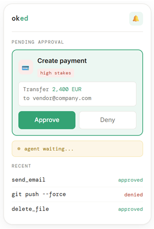

<h1 align="center">OKed SDK</h1>

<p align="center">
  <b>Your agents act. You stay in control.</b><br/>
  Human-in-the-loop approval for AI agents. Intercept before execution,
  push to your phone, block until you decide.
</p>

<p align="center">
  <a href="https://oked.ai">OKed.ai</a> &middot;
  <a href="#quick-start">Quick start</a> &middot;
  <a href="#how-it-works">How it works</a> &middot;
  <a href="#packages">Packages</a>
</p>

<p align="center">
  
</p>

---

## What is OKed?

Running agents unsupervised is a bet. OKed adds the checkpoint: it intercepts sensitive tool calls *before* execution, pushes them to your phone over Telegram or Web Push, and blocks the agent until you approve or deny.

It runs **outside the agent process**, so it can't be configured away. Even an agent that flips itself into `bypassPermissions` mode still routes sensitive actions through OKed.

## Quick start

Pick the path that matches your agent:

| I'm using… | Install |
|---|---|
| **Claude Code** | `npm install -g @oked/claude-code && oked init` |
| **OpenClaw** | `npm install @oked/openclaw` (then enable in `~/.openclaw/openclaw.json`, see [package README](./packages/openclaw)) |
| **Node.js SDK** (OpenAI / Anthropic / LangChain / custom) | `npm install @oked/sdk` |

Then sign in at [app.oked.ai](https://app.oked.ai/dashboard/) and link your Telegram (or enable web push). That's where approvals show up.

## How it works

```
Agent: send_email("vendor@…")        →  📱 Approve / Deny
Agent: rm node_modules               →  ✓ allowed (safe)
Agent: DELETE /users/42              →  📱 Approve / Deny  ⚠ irreversible
Agent: git push --force              →  📱 Approve / Deny
Agent: Read ./src/app.ts             →  ✓ allowed (safe)
```

1. **Before execution.** The hook receives each tool call before it runs. Runs outside the agent process so it cannot be bypassed.
2. **Tiered scoring.** Safe read-only operations pass instantly. Unknown or risky actions move to approval. Tiers: `safe` · `warning` · `normal` · `high_stakes`.
3. **Push to your phone.** Approval lands in Telegram or as a Web Push notification with full context: what the agent wants to do and why it was flagged.
4. **Every decision logged.** Each request, classification, and decision is persisted with a timestamp. Full audit trail, exportable any time.

### Fail-safe by default

If the OKed backend is unreachable, if the request times out, or if anything parses wrong → the agent is **denied**. The only exception is a missing API key, which falls back to the agent's native permission prompt.

## SDK example

```ts
import { OKedClient } from '@oked/sdk'

const oked = new OKedClient() // reads OKED_API_KEY from env

// one call before any sensitive action
const { approved } = await oked.approve({
  action: 'create_payment',
  description: 'Transfer 2,400 EUR to vendor@example.com',
  tier: 'high_stakes',
})

if (!approved) throw new Error('denied')

// only reaches here if you approved
await createPayment(amount, recipient)
```

The call returns `{ approved, approval_id, decision }`, where `decision` is `"approved" | "denied" | "timeout"`. Default timeout is 5 minutes; a timeout is treated as a denial.

## Packages

| Package | Purpose |
|---|---|
| [`@oked/sdk`](./packages/sdk) | Core library: programmatic approval API (`OKedClient.approve()`, tier classifier, action describer). Call directly from any Node.js agent. |
| [`@oked/claude-code`](./packages/claude-code) | Zero-code integration for Claude Code. `oked init` writes a PreToolUse hook into your project's `.claude/settings.json`. |
| [`@oked/openclaw`](./packages/openclaw) | Zero-code integration for OpenClaw via the `before_tool_call` plugin. |

## Develop

```bash
npm install
npm run build
```

Runs the build for every workspace that defines one.

## Publish

```bash
npm publish --workspaces --access public
```

Each package carries its own version; bump the version in its `packages/*/package.json` before publishing.

## License

[MIT](./LICENSE)

---

<p align="center">
  <b>oked.ai</b> &middot; Every action, OKed by you.
</p>
